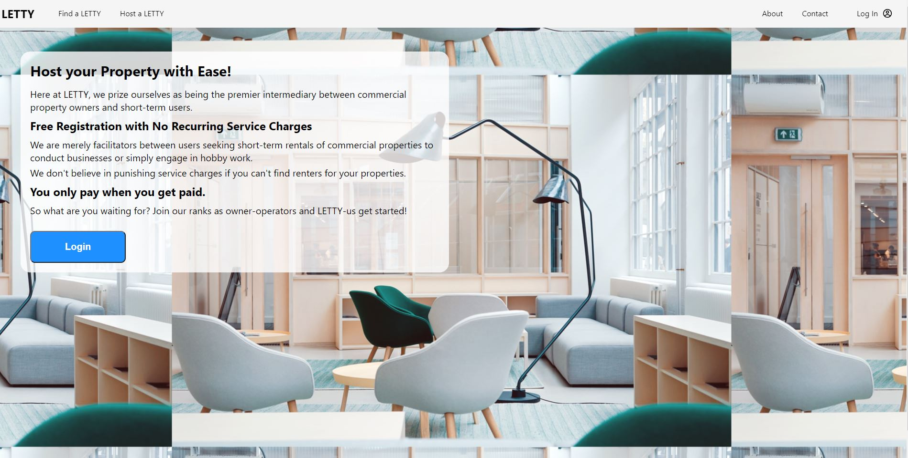

# LETTY
Concept website for short-term commercial space rental and reservations using Full-Stack Development in React.js and JSX for the front end, Node.js and Express on the back end, and MongoDB for the main site's online database, and Google Maps for map function and rendering.

---
Launch on VSCode
---
### This React.js/Node.js was designed with concurrency and convenience in mind.
You only need to open "ONE" terminal and on the root folder, launch "yarn start". Both the server and the client will run concurrently on the terminal.

#### For Debugger's Mode: Open two Terminals (no need to "cd server" or "cd client" on each terminal)
1) On the first terminal, launch "yarn run server" first to launch the Node.js express based in the server folder
2) On the second terminal, launch "yarn run client" to launch the front end React.js app based in the client folder

---
Locations Mapping
---
This website uses Google Maps API to track and discover the various properties hosted by LETTY users.

You have a wide variety of choices to choose from, art studios, auto garages, crafting workshops, and even the good old fashioned office building. There's even a filter for that at the top to narrow your search. For now, we will only be focusing on properties in and around the Montreal, Canada area.

---
Property Details
---
When you click on "View Property Details" in the left hand tile or click "View Property" on the pinpoint marker on Google Maps, the site will redirect you to the property details page.

For convenience, the details of the property have been collapsed into clickable bubbles.

<b>***Please keep in mind that you must login at the top-right corner of the screen prior to booking a reservation for a room or registering your own property for others to see and book.***</b>

Once you have decided on the property to book a space in, you set a date and click on "Set Dates", which then will check to see if the selected space will be available during your chosen dates.

It will then return a message if you can continue with the booking (if dates are available) or it will tell you to choose another set of dates because the chosen date range is not available.

Once that is done, payment information ( * required, you may use random set of numbers to test this) and an optional message to the owner can be sent with your reservation request on Submit. The page then redirects you to the profile.

---
Mobile Screen Rendering on Smaller Screens
---

Also available in mobile screens if screen size is smaller than 769 pixels as shown below with dropdowns highlighted in yellowgreen.

---
Log In Screen
---
The login screen uses an API called <a href="https://auth0.com/">Auth0</a> (click on link for more details and documentation about this API). You can practically create a local account if you haven't already registered, or use an intermediary authentication (e.g. Google, Facebook) instead. Your profile will only be used by this site and this demonstration alone.

---
Profile
---
After loggin in, you will be redirected to the homepage, where you will have many options, from booking a reservation, to checking how much balance you owe for your reservations, and how much you earn from your property LETTING.

Here, you can also check the status of your reservations and whether the owner has responded to your request. If they haven't seen it or made a decision yet, your status will be set to PENDING.

When an owner has made the decision, you will see the responses below:

While your request is pending or already been decided against by the owner, you have the option of removing them from your reservation. Only pending reservations have a "Cancel Booking ?" dropdown available.

---
Hosting a LETTY Property
---
***THIS PORTION IS EXCLUSIVELY FOR PROPERTY OWNERS, BUT AS A FLEXIBLE USER ON THIS PLATFORM, YOU CAN BOTH RESERVE SPACES AND RENT OUT YOUR OWN PROPERTY ON THE SAME ACCOUNT***

What you'll see in "Host a LETTY" if you're not logged in:

What you'll see after logging in:

Fill in your details with as much accuracy as possible. The address is particularly important as it will be converted into a readable GPS coordinates for the map portion to be correctly rendered on the webpage.

Here is an example on how to register a property on LETTY:

Once the details have been submitted, the new property is then registered to our database and you are then redirected to the property details page of the newly registered property:

---

Add New Spaces
---

Here you can add new spaces for rent, recommended capacity for this space, and the daily rate.

Once it's been added, you will see it on the property details page. Conversely, if you made an error, or want to take the room out of service, deleting this room is possible. However, if people already made reservations for this room, those reservations will also be cancelled with an automated message from the server.

---
Approve / Reject Reservation
---
As an owner, you have the ability to reject or approve the reservation and also add a reply that will be seen by the reserving user if you choose to send the optional reply message.

On your profile page, if you have unresolved/pending reservations for your properties, it will be flashing orange underneath "Your Properties" section.

Once you click on your property, it will be redirected to your property details page where you can approve or reject it.

---
THAT'S ALL FOLKS // GET INSPIRED!
---
### Project Author: Brandon Cha

<a href="https://github.com/bcha92">GitHub</a>

<a href="https://www.linkedin.com/in/brandon-cha-928775a8/">LinkedIn</a>
